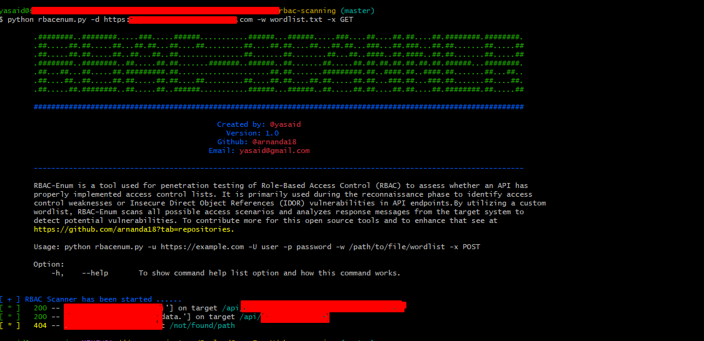

# Introduction
---
RBAC-SCANNER is a tool that uses reconnaissance and exploits endpoints to find the possibility of a raised vulnerability **Broken Function Level Authorization** or similar vulnerability in a web application. These tools can use a QA to validate a Role Base Access Control in the Web Application or the API Endpoint. 

# How to use
---
In this step, you need to know how to use these tools. The tools need parameters to get and execute the process to find a vulnerability in your target. You can use the tools with the command
```
rbacenum.py -u [url] -u [user] -p [password] -d [TARGET_DOMAIN] -w [WORDLIST] -x [REQUEST_METHOD]
```
Explained the command option:  
-u, --url             Url target your web application or API for the login into the application, for example, myapps.com/login or api.myapps.com/api/v1/auth.  
-U, --user            Username to use login in the application.  
-p, --password        The credentials of username to log in to the application.  
-d, --target_domain   This is the domain of the target web application or API, if not set, the tool will use the domain of the url.  
-w, --wordlist        This path file containing a list of endpoints in your application that will be used to scan or list the target of the endpoint to scan or pentest.  
-x, --request_method  This is a request method to use in the request to the target, example: GET, POST, etc.  

# Example image
---



